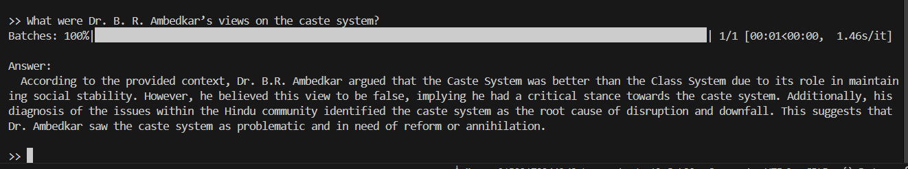

# AmbedkarGPT – SEMRAG-based RAG System

## 📌 Overview
AmbedkarGPT is a Retrieval-Augmented Generation (RAG) system implemented
based on the **SEMRAG research paper**.  
The system answers questions about **Dr. B. R. Ambedkar’s works** by
combining semantic chunking, knowledge graphs, and graph-based retrieval
with a local Large Language Model (LLM).

---

## 🧠 System Architecture
The system follows the SEMRAG pipeline:

1. **Semantic Chunking**
   - Sentence embeddings with cosine similarity
   - Buffer merging for contextual continuity
   - Token-aware chunk splitting

2. **Knowledge Graph Construction**
   - Entity extraction using spaCy
   - Relationship extraction via dependency parsing
   - Graph construction using NetworkX
   - Community detection (Louvain / Leiden)

## 3. Retrieval Strategies

SEMRAG employs a **dual retrieval strategy** that combines precise entity-level search with broader community-level context to ensure accurate and grounded responses.

### Retrieval Overview

| Strategy | Focus Level | Retrieval Method | Key Steps | Output |
|--------|------------|------------------|-----------|--------|
| **Local Graph RAG**   *(SEMRAG Eq. 4)* | Entity-level | Retrieves chunks linked to entities most similar to the query | • Compute cosine similarity between query and entity embeddings • Filter entities using threshold **τe** • Retrieve chunks connected to selected entities • Compute similarity between query and chunk embeddings • Filter chunks using threshold **τd** • Rank and select top-K chunks | High-precision, entity-specific evidence |
| **Global Graph RAG**   *(SEMRAG Eq. 5)* | Community-level | Retrieves chunks from relevant communities (clusters of related entities) | • Compute community embeddings (mean of entity embeddings) • Compute similarity between query and community embeddings • Select top-K communities • Retrieve all chunks from selected communities • Rank chunks by relevance | Broader thematic context for multi-hop reasoning |
| **Similarity Thresholding** | Both | Filters entities and chunks using similarity scores | • Apply **τe** for entity similarity • Apply **τd** for chunk similarity | Removes low-relevance noise |
| **Top-K Ranking** | Both | Ranks candidates by final relevance score | • Sort chunks by combined score • Select top-K results | Controls context size and reduces latency |

---

## 4. LLM Integration

| Component | Description |
|---------|-------------|
| **LLM Provider** | Local LLMs (Mistral / Llama 3) served via **Ollama** |
| **Prompt Strategy** | Professionally designed SEMRAG prompt template with silent grounding |
| **Context Input** | Reranked local + global chunks (no chunk IDs or metadata) |
| **Answer Generation** | Concise, factual responses strictly grounded in retrieved context |
| **Hallucination Control** | Low temperature (0.1–0.2) and strict prompt constraints |

---

---

## 🛠️ Tech Stack
- **Python 3.9+**
- sentence-transformers
- spaCy
- networkx
- scikit-learn
- langchain
- Ollama (Llama3 / Mistral)

---

## 📂 Project Structure

ambedkargpt/
├── data/
│ ├── Ambedkar_works.pdf
│ └── processed/
│ ├── chunks.json
│ └── knowledge_graph.pkl
├── src/
│ ├── chunking/
│ │ ├── semantic_chunker.py # Algorithm 1 (SEMRAG)
│ │ └── buffer_merger.py
│ ├── graph/
│ │ ├── entity_extractor.py
│ │ ├── graph_builder.py
│ │ ├── community_detector.py
│ │ └── summarizer.py
│ ├── retrieval/
│ │ ├── local_search.py # Equation 4 (SEMRAG)
│ │ ├── global_search.py # Equation 5 (SEMRAG)
│ │ └── ranker.py
│ ├── llm/
│ │ ├── llm_client.py
│ │ ├── prompt_templates.py
│ │ └── answer_generator.py
│ └── pipeline/
│ └── ambedkargpt.py # Main pipeline
├── tests/
│ ├── test_chunking.py
│ ├── test_retrieval.py
│ └── test_integration.py
├── config.yaml
├── requirements.txt
├── setup.py
└── README.md

## 📚 References

- SEMRAG: Semantic Retrieval-Augmented Generation (Research Paper)
- Dr. B. R. Ambedkar – Collected Works

## Output:

